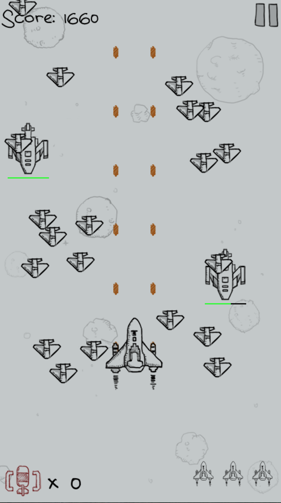
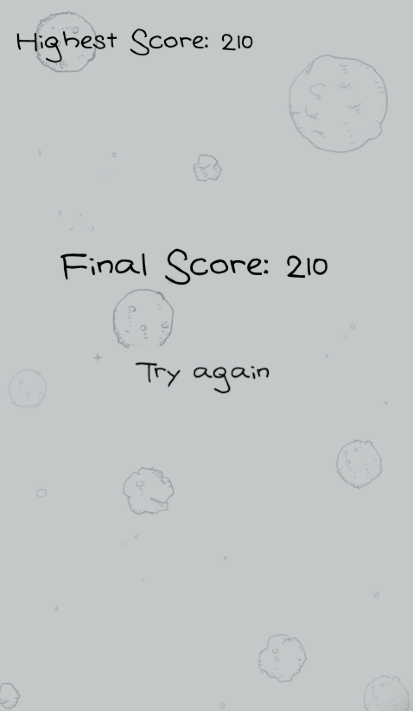

This game is all about a simplified but still fun-to-play version of the classic game Raiden. All game contents could be found within two folders: image and sound.

The game was implemented in Python, basically using Pygame. For those who havn't had a chance to try **`Pygame`** library, please use **`pip install pygame`** first.

Full screen bomb, double and super-fast bullets included. And I added the HP bar to indicate the remaining health of enemy spacecrafts, but only for mid or high level enemy spacecrafts. Because you could eliminate those tiny guys with only one shot, no bother to show their HP bar.

After any crash, the jet would flicker for seconds. It indicates the invincibility of your jet in that short period.

Best historical score will only be recorded in the **`record.txt`** when you lose all your three life points.

When you pause the game, the battleground will be hidden on purpose. Yes, no time to contemplate your situation.

Last but not the least, lets have a glance of how the game looks like. Pretty cool right？

